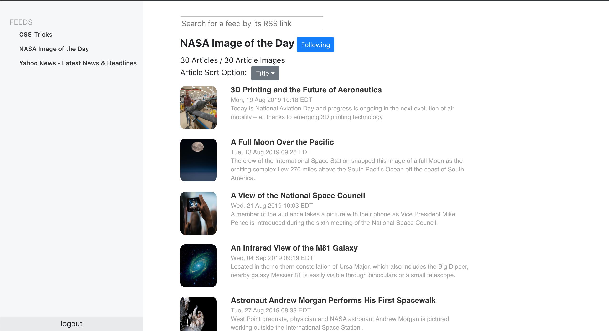

# RSS Feed Reader 



## Install Instructions
Run these commands from the root directory after pulling down the repo.
```
> npm install
> npm run build
> cd src/server
> node server.js
RSS server listening on port 8000!
```

The server should be listening on port 8000 if everything goes correctly. You'll access the homepage
at `http://localhost:8000/`, but this web application also supports deep linking, so URLs like 

`http://localhost:8000/rss?feedUrl=https://www.nasa.gov/rss/dyn/lg_image_of_the_day.rss` 

will work as well.